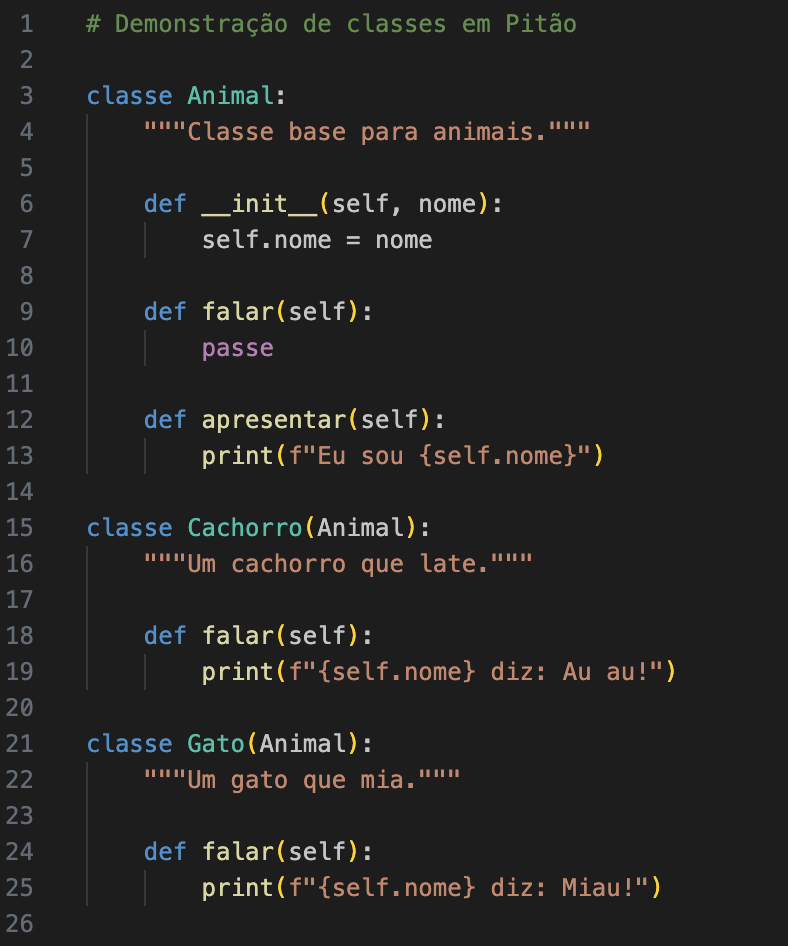
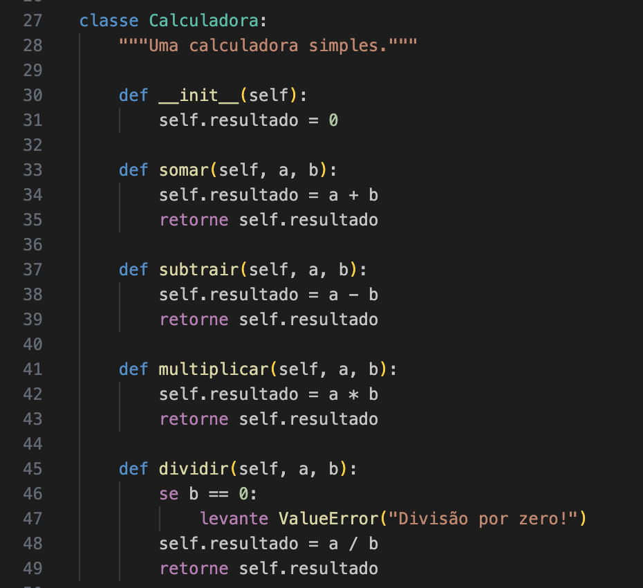

# Pitão - Extensão VS Code

Realce de sintaxe para **Pitão** - Python com palavras-chave em Português.

## Funcionalidades

- Realce de sintaxe para arquivos `.pt` e `.pit`
- Destaca todas as palavras-chave do Python em Português (veja tabela abaixo)
- Alternar comentários com `Ctrl+/` / `Cmd+/`
- Fechamento automático de parênteses e strings
- Indentação inteligente para palavras-chave de controle de fluxo

## Galeria





## Palavras-chave

| Português | Python | | Português | Python |
|-----------|--------|---|-----------|--------|
| `Falso` | `False` | | `importe` | `import` |
| `Nulo` | `None` | | `em` | `in` |
| `Verdadeiro` | `True` | | `eh` | `is` |
| `e` | `and` | | `nao` | `not` |
| `ou` | `or` | | `passe` | `pass` |
| `se` | `if` | | `retorne` | `return` |
| `senaose` | `elif` | | `tente` | `try` |
| `senao` | `else` | | `exceto` | `except` |
| `para` | `for` | | `finalmente` | `finally` |
| `enquanto` | `while` | | `levante` | `raise` |
| `quebre` | `break` | | `com` | `with` |
| `continue` | `continue` | | `produza` | `yield` |
| `def` | `def` | | `assincrono` | `async` |
| `classe` | `class` | | `aguarde` | `await` |
| `del` | `del` | | `afirme` | `assert` |
| `de` | `from` | | `como` | `as` |
| `global` | `global` | | `naolocal` | `nonlocal` |

## Instalação

### Instalando a partir do código fonte

1. Clone o repositório:
   ```bash
   git clone https://github.com/ivancrneto/pitao.git
   cd pitao/vscode-pitao
   ```

2. Copie para a pasta de extensões do seu editor:

   **VS Code:**
   ```bash
   # macOS/Linux
   cp -r . ~/.vscode/extensions/pitao-syntax

   # Windows
   xcopy /E /I . %USERPROFILE%\.vscode\extensions\pitao-syntax
   ```

   **Cursor:**
   ```bash
   # macOS/Linux
   cp -r . ~/.cursor/extensions/pitao-syntax

   # Windows
   xcopy /E /I . %USERPROFILE%\.cursor\extensions\pitao-syntax
   ```

   **Antigravity:**
   ```bash
   # macOS/Linux
   cp -r . ~/.antigravity/extensions/pitao-syntax

   # Windows
   xcopy /E /I . %USERPROFILE%\.antigravity\extensions\pitao-syntax
   ```

3. Reinicie o editor

### Instalando via arquivo VSIX

1. Empacote a extensão:
   ```bash
   cd pitao/vscode-pitao
   npx vsce package
   ```
   Isso cria um arquivo `pitao-0.0.1.vsix`

2. No editor, pressione `Cmd+Shift+P` (macOS) ou `Ctrl+Shift+P` (Windows/Linux)

3. Digite "Instalar do VSIX" ou "Install from VSIX"

4. Selecione o arquivo `.vsix` criado

### Modo de Desenvolvimento

Para testar a extensão durante o desenvolvimento:

```bash
cd /caminho/para/pitao/vscode-pitao
code --extensionDevelopmentPath=.
```

Isso abre uma nova janela do editor com a extensão carregada.

## Licença

MIT

---

## English Version

# Pitão - VS Code Extension

Syntax highlighting for **Pitão** - Python with Portuguese keywords.

## Features

- Syntax highlighting for `.pt` and `.pit` files
- Highlights all Portuguese Python keywords
- Comment toggling with `Ctrl+/` / `Cmd+/`
- Auto-closing pairs for brackets and strings
- Smart indentation for Portuguese control flow keywords

## Installation

### From Source

1. Clone the repository:
   ```bash
   git clone https://github.com/ivancrneto/pitao.git
   cd pitao/vscode-pitao
   ```

2. Copy to VS Code extensions folder:
   ```bash
   # macOS/Linux
   cp -r . ~/.vscode/extensions/pitao-syntax

   # Windows
   xcopy /E /I . %USERPROFILE%\.vscode\extensions\pitao-syntax
   ```

3. Restart VS Code

### Development

To test the extension during development:

```bash
cd /path/to/pitao/vscode-pitao
code --extensionDevelopmentPath=.
```

This opens a new VS Code window with the extension loaded.
